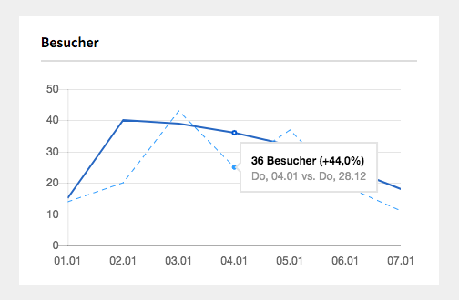

# Kirby Analytics Dashboard

Kirby Analytics Dashboard is a [Kirby](http://getKirby.com) plugin which extends your dashboard with some Google Analytics statistics and reports. It does not emulate Google Analytics itself but provides a nice and simple overview about how your site is doing.

If you need detailed reports head over to your [**Google Analytics Dashboard**](https://analytics.google.com/analytics/web).

## Widgets

Currently there is only one widget available but it is planned to add some more. Feel free to open an issue for feature requests :)

**Visitors** – Compares data of the last seven days with those of the previous week.



## Installation

### Kirby CLI

If you are using the Kirby CLI you can install this plugin by running the following command in your shell from the root folder of your Kirby installation:

```bash
kirby plugin:install gearsdigital/kirby-analytics-dashboard
```

### Manual

1. Download the [**latest release**](https://github.com/gearsdigital/kirby-analytics-dashboard/releases/latest)
2. Extract the zip and upload the extracted folder to `/site/plugins`
3. Add the following entries to `/site/config/config.php`
   
	```php
	c::set('analytics.dashboard.view.id', 'ga:XXXXXXXXX');
	c::set('analytics.dashboard.client.id', 'XXXXXXXXX.apps.googleusercontent.com');
	```

4. After logging in to your Kirby panel, you should see a new widget containing the »**Sign in with Google**« Button.

**Please Note:** You will not receive any data until you have completed the prerequisite setup!


## Prerequisites

Request blocking browser extensions like `uBlock Origin` or `Ghostery` will probably block all request to Google. So make sure to whitelist your panel or temporarily disable those extenstions.

In order to retrieve data from Google Analytics you have to create a Google Service Account and create a **client ID**. A **view ID** is required as well.

## How to get a Client ID

A client ID is used to anonymously identify a browser instance and is mandatory for all Google Analytics Reporting API requests. 

1. Create a Google Service Account
2. Enable Google Analytics Reporting API
3. Create a OAuth client ID

### Create a Google Service Account

- Open the [**Cloud Resource Manager**](https://console.developers.google.com/projectcreate) and create a new project.

### Enable Google Analytics Reporting API

- Go to your [**Project Dashboard**](https://console.developers.google.com/apis/dashboard) locate and click the link **Enable APIs and Services**. Search for **Google Analytics Reporting API** and enable this API.

### Create a OAuth Client ID

- Locate the Button **Create Credentials** and create a new **OAuth client ID**
- Add a product name and hit save. All other fields can be solely ignored.
- Now you need to define an **Application type**. In our case just select **Web application**.
- A **authorized JavaScript origin** is **mandatory** and has to match your Kirby installation URL. If your local Kirby installation is running under localhost add `http://localhost` or `http://localhost:8080`. Otherwise insert your domain.
- After you have created your OAuth client, you should be able to find your **Google client ID**.

The client ID should look like: `xxxxxxxxxxx.apps.googleusercontent.com`
	 
## How to get a Google View ID

One way to retrieve a view ID is the [**Google Account Explorer**](https://ga-dev- tools.appspot.com/account-explorer/). Use this tool to search or browse through your accounts, properties, and views, See what accounts you have access to, and find the IDs that you need for the API or for another tool or service that integrates with Google Analytics.

You will find the view ID under **Table ID (ids)**.

An alternative approach is to go to **Google Analytics** > **Administration** > **View settings**. Do not forget to add the prefix: `ga:`.

The view ID should look like: `ga:12345678`.

## Languages

Currently are three languages supported. English (default), German and French. If you want to explicitly set a language just add this to your `config.php`.

```php
c::set('analytics.dashboard.language', 'de'); // en, fr
```
The built-in support for multi-language sites is respected.

## Quotas

As Google Analytics is used by millions of sites they put limits and quotas on API requests to protect the system from receiving more data than it can handle. Learn more about [**limits and quotas**](https://developers.google.com/analytics/devguides/reporting/core/v4/limits-quotas).

This plugin is using only the **Google Analytics Reporting API** which means our limit is **10000 requests per day**. I do not expect any issues here because Kirby is used mostly on small sites but I will improve this plugin and add some caching later this year. 

## Contributors

Thank you very much for your effort.

[**@labs-scnm**](https://github.com/labs-scnm) [(df98a74)](https://github.com/gearsdigital/kirby-analytics-dashboard/commit/0ea8db8e1f31707ecb5a594008d84d4991b39f80)

## Contributing

All contributions are very welcome – if you found a bug please tell me!
